# Fiche d'une photo, profil public, bouton d'amitié, sécurité des amitiés — 6 octobre 2026 (0.16.0)

Projet : [PICTI](../../CLAUDE.md) · Branche `claude/fiche-photo`
Voir aussi : [Likes et reproductions (0.15.0)](2026-10-06-likes-et-reproductions.md) · [Amis (0.14.0)](2026-10-06-amis.md)

## Demande d'Eliott

Prompt « 0.016.0 » (décisions du 06/10 : la fiche d'une photo). Quand on appuie sur une photo, ou
juste après l'avoir capturée, on arrive sur sa **fiche** : la photo en grand, puis en descendant
l'auteur (cliquable → profil public, ajout en ami), la date et l'heure de la prise, et les photos
liées (ses reproductions, ou l'originale d'une reproduction) — sans le mot « galerie ». Cinq choses :

1. La fiche (refonte de `PhotoDetail`, même route).
2. Le profil public (`#/personne/<id>`).
3. Le bouton d'amitié.
4. Quand la fiche s'ouvre (partout, viseur, après une capture, après une prise de vue).
5. Un rapport de sécurité sur `profiles` / `friendships`, sans rien changer sans accord.

## Ce qui a été fait

- **Fiche** (`src/screens/PhotoDetail.tsx`) : la photo occupe tout l'écran à l'ouverture (pile du
  lieu glissable, noir et blanc tant qu'elle n'est pas capturée), léger dégradé et **poignée**
  (bouton « Faire défiler jusqu'à la fiche »). Dessous : Chasser / Revoir in situ, Reproduire,
  Enregistrer ; **l'auteur** (avatar, nom, ville ; toute la ligne → son profil ; bouton d'amitié ;
  « Vous » pour mes photos) ; **« Prise le samedi 26 septembre 2026 à 20 h 53 »** (heure locale du
  téléphone ; photo importée prise un autre jour : « · ajoutée à PICTI le … » ; date inconnue :
  « Ajoutée à PICTI le … »), distance d'ici, mode, selfie, capturée ; **« D'après la photo
  d'Alice »** (grande vignette de l'originale, date et heure de prise, likes → sa fiche ; Avant /
  après ; « Voir les 2 autres reproductions » → fiche de l'originale, ancrée sur la frise) ;
  **« Au fil du temps · refaite 3 fois »** (frise : l'originale, puis ses reproductions par date de
  prise ; Avant / après sur chacune ; « et 1 autre que vous ne pouvez pas voir ») ; **Ma photo**
  (titre / Renommer, visibilité, distance du sujet, « Aimée par … », Supprimer) ; **Détails
  techniques** repliés (statut, cap, inclinaison, roulis, position — la mienne —, précision,
  focale, dimensions). Une requête `version_of = id` par photo et par visite (`useVersions`), puis
  lecture dans le store.
- **Profil public** (`src/screens/Person.tsx`) : avatar, nom, ville, « Sur PICTI depuis septembre
  2026 », bouton d'amitié, « 2 photos visibles » et leur grille (une vignette par lieu, ↻, likes) ;
  « Ses photos réservées aux amis apparaîtront quand vous serez amis. » ; mon propre profil →
  « Moi » ; compte inexistant → message + Retour. Jamais le code ami, l'offre ni l'e-mail.
  Fonction SQL `public_profile` (migration `20261006200000_profil_public.sql`, **pas appliquée**,
  voir plus bas) ; en attendant, l'app lit les mêmes champs dans `profiles`.
- **Noms cliquables** vers le profil : notifications (« **Clément** aime votre photo » : le nom
  ouvre le profil, le reste de la ligne la photo), Mes captures (auteur sous la vignette), Mes
  proies, Mes chasseurs, « Aimée par … », amis / demandes / recherche par nom.
- **Bouton d'amitié** (`FriendButton`) : Ajouter en ami → Demande envoyée (appui : « Annuler la
  demande ? ») ; demande reçue → Accepter / Refuser ; Amis ✓ (appui : Retirer de mes amis →
  confirmation). Change aussitôt, revient en arrière si la base refuse ; état tiré de la liste
  d'amis (`friendState`, testé). Rien de nouveau côté base (les policies existantes suffisent pour
  ces actions — mais voir « Sécurité »).
- **Ouverture de la fiche** : appui sur une photo partout → `#/photo/<id>` (carte, galerie du lieu,
  Mes photos, Mes captures, À retrouver, À proximité, Recherche, notifications, profil public,
  frise). **Viseur** : appui sur une photo → sa fiche ; à moins de 5 m, la photo d'un autre pas
  encore capturée se capture d'un appui ; le bouton « Chasser » de la frise ouvre toujours la
  chasse. **Après une capture** (viseur et chasse) : célébration ~1,5 s (« Capturée ! »), puis la
  fiche monte **en feuille** par-dessus la caméra (« Capturée ✓ · aimée sur place », Reproduire en
  avant, « Contempler in situ ») ; on la redescend d'un glissement (ou ✕, Échap, bouton retour)
  pour retrouver la photo in situ en couleur ; « Fiche » la rouvre. La capture est enregistrée
  avant l'ouverture, la caméra continue de tourner. **Après une prise de vue** : miniature 5 s dans
  le coin bas-gauche (à la place du « + »), appui → fiche ; le toast garde son texte, sans bouton.
- **Bouton retour** du téléphone / navigateur : ferme la feuille (ou l'avant / après) avant de
  quitter l'écran (`useBackCloses`, entrée d'historique sans changer d'adresse).
- **Corrigé au passage** : la classe `.captured` de la célébration de la chasse s'appliquait aussi à
  la carte de capture du viseur une fois capturée (z-index 30) et cachait le message par-dessus ;
  la célébration a maintenant sa classe `.capture-celebration` et `.capture-card.captured` neutralise
  `.captured` (gardée telle quelle : la 0.15.2 s'en sert pour sa carte « lieu quitté »).

## Choix faits en codant (à valider)

- Dans la frise d'une reproduction elle-même refaite, la première vignette s'appelle **« Cette
  photo »** et non « Originale » (l'originale est dans « D'après la photo de … » juste au-dessus).
- Une reproduction jamais refaite n'a **pas** de section « Au fil du temps » (sinon « Personne n'a
  encore refait cette photo » s'affichait sous « D'après la photo d'Alice », ce qui prêtait à
  confusion) ; le prompt (cas c) va dans ce sens.
- Aucune reproduction visible mais un compteur > 0 : « 2 reproductions que vous ne pouvez pas voir »
  (sans frise).
- « Renommer » passe dans le bloc **Ma photo** (le crayon sur la photo plein écran est retiré).
- Viseur : un appui sur une photo **à moins de 5 m** qui n'est pas capturable (la mienne, déjà
  capturée) ouvre sa fiche.
- Après la capture depuis le viseur, plus de toast « Photo capturée · aimée sur place » : la
  feuille le dit.
- « À retrouver in situ » (Mes chasses) et « À proximité » ouvrent maintenant la fiche (avant : la
  chasse ou le recalage) ; « Chasser in situ » / « Géocadrer sur place » en sont le premier bouton.
- En mode « Reproduire », une photo non rattachée garde son toast « Voir » (la miniature prendrait
  la place du bouton ✕).
- Profil public : le nombre affiché est celui des photos **géocadrées** visibles (celles de la grille).
- La ville de l'auteur, sur la fiche, est lue une fois par visite (`public_profile`).

## Sécurité (rapport ; rien d'appliqué)

**Faille réelle sur les amitiés.** La policy « Accepter une demande reçue » ne vérifie que
`addressee` et `status`, et le compte connecté a le droit `UPDATE` sur **toutes** les colonnes de
`friendships`. Le destinataire d'une demande peut donc réécrire `requester` : avec un second compte
qui lui envoie une demande, n'importe qui devient « ami » de n'importe qui, sans son accord, et voit
ses photos « amis ». L'identifiant de la cible suffit (il est sur ses photos et dans la recherche).
**Vérifié sur la base** le 06/10 dans une transaction entièrement annulée : 1 ligne modifiée, B et C
amis.

**Code ami et offre lisibles.** La policy « Profils lisibles par les utilisateurs connectés » expose
toutes les colonnes (`friend_code`, `plan`, `default_visibility`) à tout compte connecté. `friend_code`
seul **ne suffit pas** à devenir ami : `addFriend` / `findByFriendCode` ne font qu'envoyer une demande
(`pending`), que l'autre doit accepter. Mais tout le monde peut lister les codes et voir qui est
Premium.

**Correctif proposé** : `supabase/propositions/2026-10-06-droits-amities-et-profils.sql` (hors de
`migrations/`, pour ne jamais être appliqué par erreur) :

- **A** (tout de suite, compatible 0.15.x) : sur `friendships`, droit de mise à jour limité à
  `status`, policy « Accepter » réservée aux demandes en attente ; droits d'écriture retirés à `anon`.
- **B1** (tout de suite, n'enlève rien) : `my_profile()` (mon profil complet) et
  `find_profile_by_friend_code(code)` (lien d'invitation, ajout par code). La 0.16.0 s'en sert si
  elles existent, sinon lit la table comme avant (un appel refusé de plus au démarrage tant
  qu'elles n'existent pas).
- **B2** (seulement **après** la 0.16.x en ligne — la 0.15.x lit encore `friend_code` et `plan`
  dans la table) : `profiles` lisible par les autres en `id, name, city, created_at` seulement.

Essayé sur la vraie base, transaction annulée (3 comptes d'essai) : l'attaque est **refusée**
(« permission denied for table friendships ») ; l'acceptation normale marche ; une amitié acceptée
ne repasse pas en attente ; `public_profile` répond (« friends » / « none ») et refuse les
anonymes ; le code ami et l'offre d'un autre sont refusés ; nom et ville restent lisibles ;
`my_profile`, `find_profile_by_friend_code`, `search_profiles`, `photos_in_bounds` et la
modification de son profil marchent.

**Migration `public_profile`** (`supabase/migrations/20261006200000_profil_public.sql`) : nouvelle
fonction seulement, rien de supprimé ; essayée dans la même transaction annulée. **À appliquer avec
l'accord d'Eliott**, comme le correctif.

## Vérifications

- `npm test` : 245 tests (226 avant) — « Prise le … à … » (direct, différé un autre jour, le jour
  même, sans date de prise, 1er du mois, minuit), « Sur PICTI depuis … », `friendState` (rien,
  envoyée, reçue, amis, demandes croisées), frise (originale d'abord, date de prise, sans date,
  égalités, reproductions directes seulement), « et n autres que vous ne pouvez pas voir »,
  « Voir les n autres reproductions », morceaux des notifications (noms à part), routes
  `#/personne/<id>` et `#/photo/<id>/fil`. `npm run lint`, `npm run build` : OK. `src/geo` intact.
- **Chrome sans interface** (390 × 844), vraie application sur la fausse base du banc (deux
  comptes, Alice et Bruno, dans deux onglets ; GPS, boussole, accéléromètre et caméra simulés) :
  - Bruno : notification → fiche ; « Clément » dans la notification → son profil ; galerie du
    lieu → fiche ; carte (fiche du groupe) → fiche.
  - Fiche du Vieux-Port : plein écran, poignée au clavier, auteur « Alice · La Rochelle » + Ajouter
    en ami, « Prise le samedi 26 septembre 2026 à 20 h 53 », « Au fil du temps · refaite 3 fois » :
    Originale d'Alice, Clément, Ewan, « et 1 autre que vous ne pouvez pas voir » (celle de Denise,
    réservée à ses amis) ; libellés lus par VoiceOver (« Reproduction d'Ewan, 5 octobre 2026 à
    20:53 ») ; Avant / après, fermé par le bouton retour du navigateur sans quitter la fiche ;
    détails techniques dépliés.
  - Reproduction de Clément → « D'après la photo d'Alice » → « Voir les 2 autres reproductions » →
    fiche de l'originale sur la frise ; grande vignette → originale.
  - Auteur → profil public d'Alice : ni « ALICE1 » ni « Premium » à l'écran, « 1 photo visible » +
    la phrase sur les photos d'amis ; Ajouter en ami → « Demande envoyée » aussitôt (toast) → menu
    « Annuler la demande ? » (Échap le ferme). Onglet d'Alice : profil de Bruno « Accepter /
    Refuser » → Accepter → « Amis ✓ » (menu Retirer → confirmation). Bruno revient : « Amis ✓ »,
    « 2 photos visibles » (sa photo « amis » apparaît).
  - Viseur à 20 m : appui sur la photo → sa fiche. À 3 m : appui → « Ne bougez plus… » →
    « Capturée ! » → la feuille monte (« Capturée ✓ · aimée sur place ») ; capture en base ;
    glissée vers le bas → contemplation en couleur, « Fiche » dans la frise → rouverte → bouton
    retour : fermée, toujours sur l'accueil.
  - Mes captures → fiche ; auteur sous la vignette → profil.
  - Prise de vue → toast « Photo géocadrée · visible par vos amis · ↻ même vue que la photo
    d'Alice » + miniature → fiche de ma photo (« Vous », Ma photo) ; 5 s plus tard le « + » revient.
  - Chasse de la reproduction de Clément : « Capturer » → célébration → feuille → ✕ →
    contemplation + « Fiche » → rouverte → auteur → profil → retour à la chasse.
- **Pas fait** : vrai téléphone et vrais comptes (Claude ne saisit pas d'identifiants) ; la
  migration et le correctif ne sont pas appliqués (accord d'Eliott).

## Captures d'écran (banc d'essai)

| | |
| --- | --- |
| 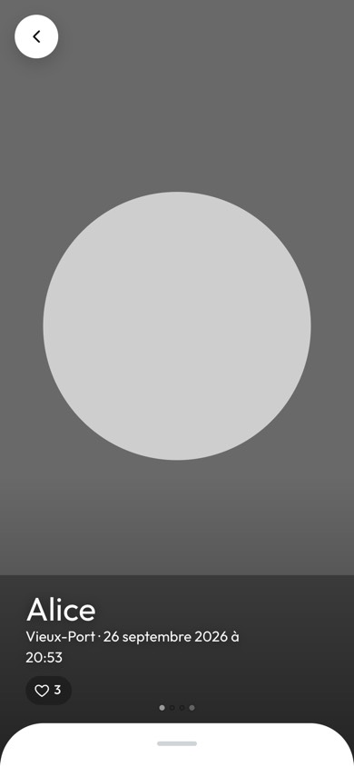 Photo en grand | 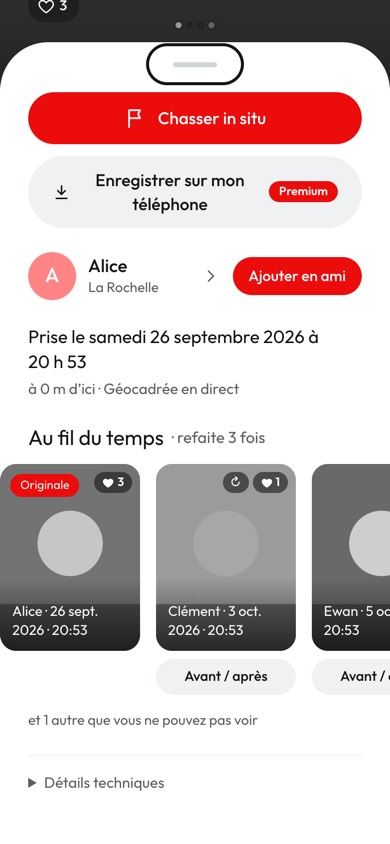 Auteur, date, « Au fil du temps » |
| 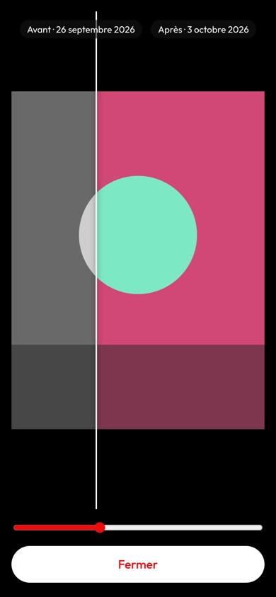 Avant / après | 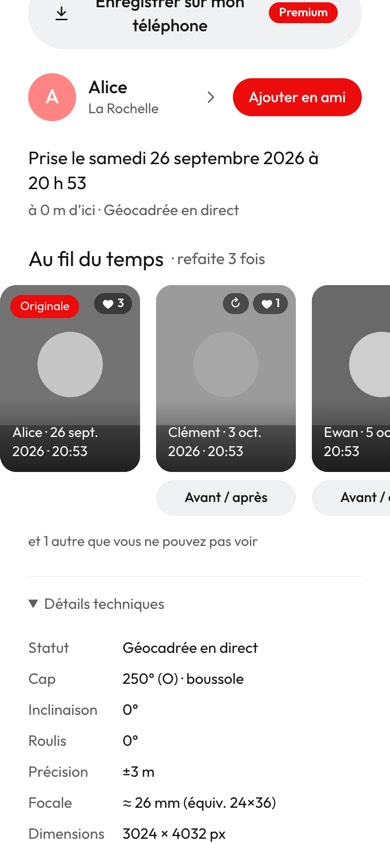 Détails techniques |
| 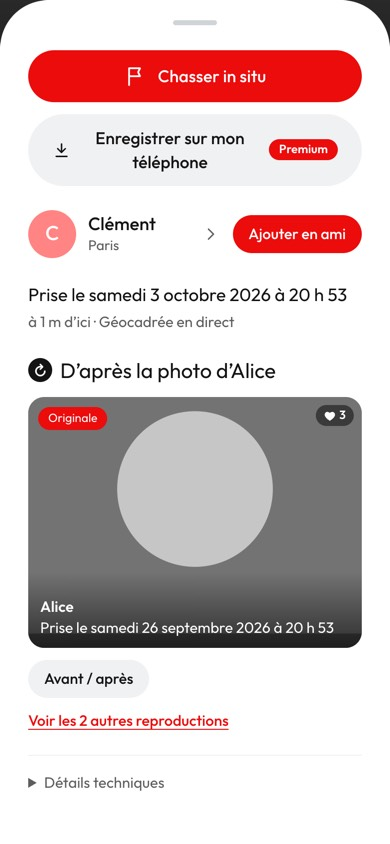 « D'après la photo d'Alice » | 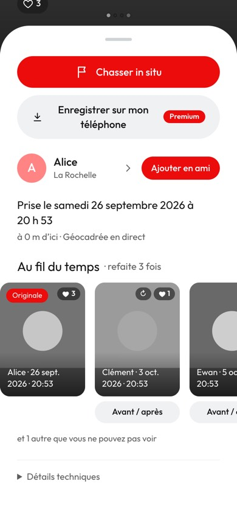 Originale, sur la frise |
| 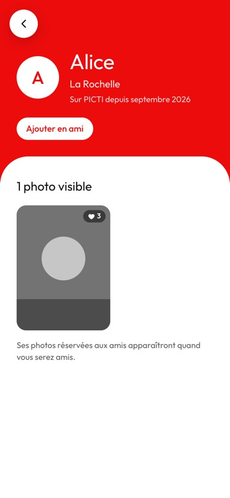 Profil public (pas amis) | 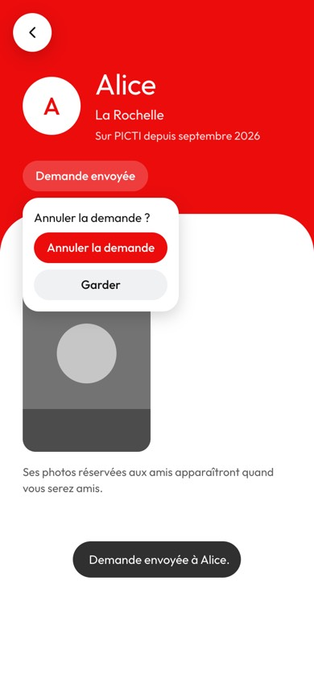 Demande envoyée |
| 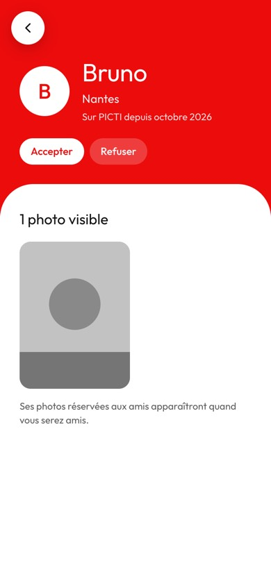 Alice : demande reçue | 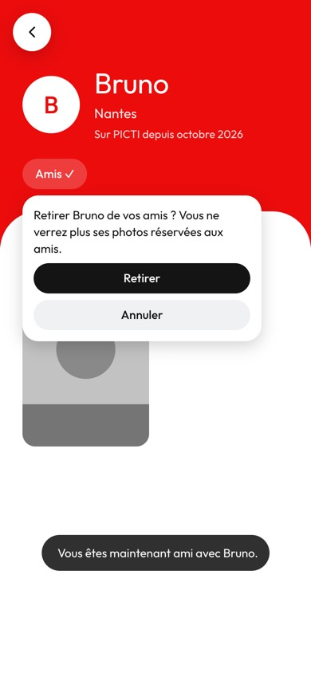 Retirer (confirmation) |
| 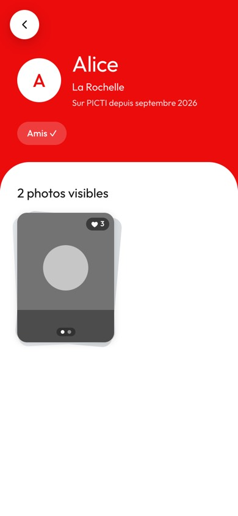 Amis ✓, photos « amis » | 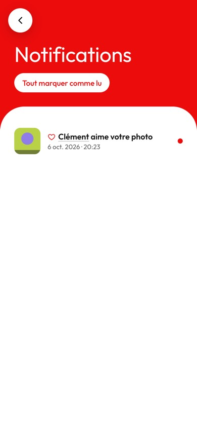 Notifications : nom cliquable |
| 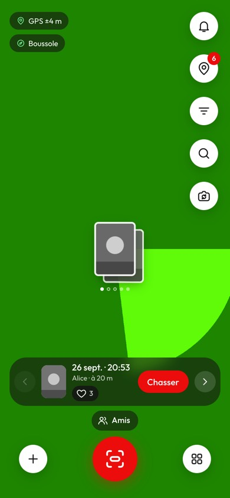 Viseur à 20 m |  Capturée ! |
| 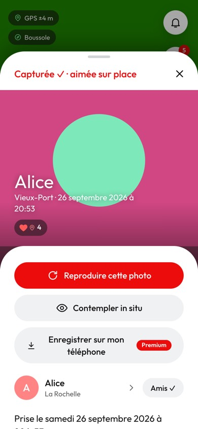 Feuille par-dessus la caméra | 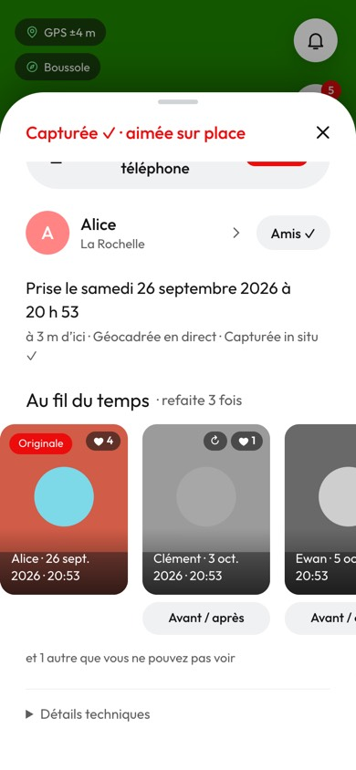 Feuille défilée |
| 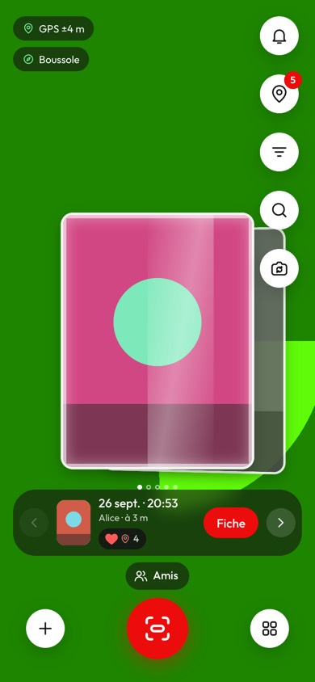 Contemplation, « Fiche » | 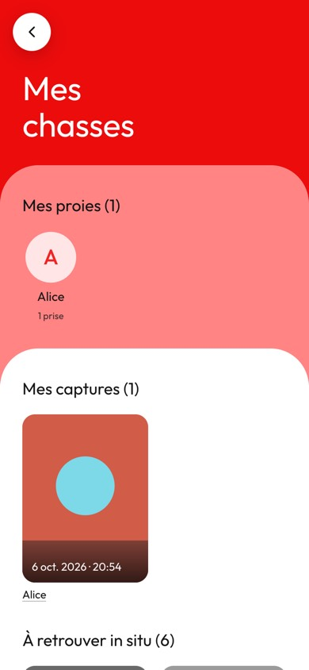 Mes captures, auteur |
| 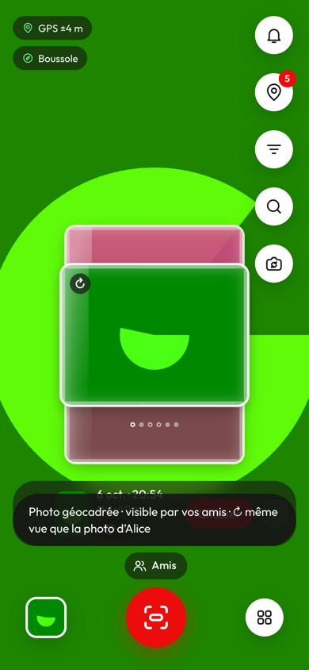 Miniature après la prise | 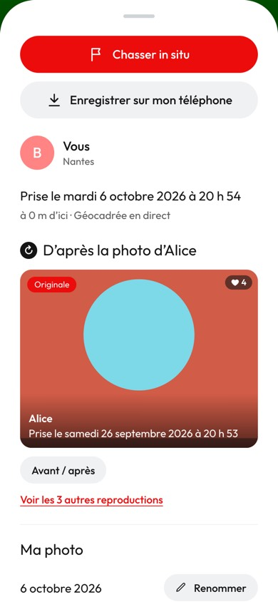 Ma photo |
| 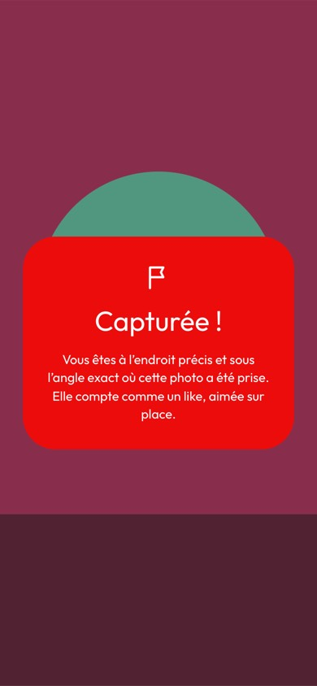 Chasse : célébration | 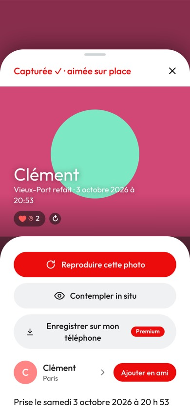 Chasse : feuille |
| 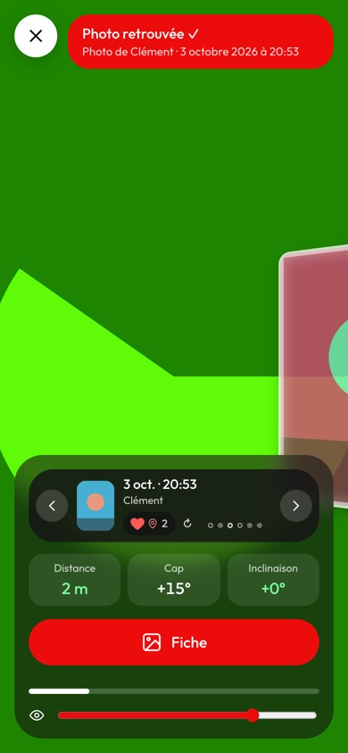 Chasse : contemplation | |

## Mise en ligne

- Accord d'Eliott (06/10) : appliquer `public_profile` et le correctif A + B1, et mettre la
  0.016.0 en ligne. Entre-temps la **0.15.2** a été publiée : elle est **fusionnée** dans cette
  branche (conflits : `Home.tsx` — la miniature et les toasts sans bouton passent dans `save()` de
  la 0.15.2 —, version, docs). 267 tests (248 + 19), lint, build OK ; les parcours 0.16.0 (ci-dessus)
  et 0.15.2 (bandeaux, carte « lieu quitté », image figée, GPS imprécis, moyenne à l'arrêt) rejoués
  sur le code fusionné : identiques.
- `main` avancée sur cette branche (mise en production automatique, sans PR, à la demande d'Eliott).
  Retour arrière : 0.15.2 = `dpl_CzAQHyjkdtHaYc5XbwPDpfhKXFzg`.
- **Base : rien d'appliqué.** L'outil de sécurité de Claude Code (mode automatique) a refusé
  d'appliquer les migrations à la base de production, malgré l'accord d'Eliott. À coller dans
  Supabase › SQL Editor : `supabase/migrations/20261006200000_profil_public.sql`, puis
  `supabase/propositions/2026-10-06-droits-amities-et-profils.sql` (B2 y est en commentaire : seuls
  A et B1 s'appliquent). La 0.16.0 marche sans (elle lit alors `profiles`).
